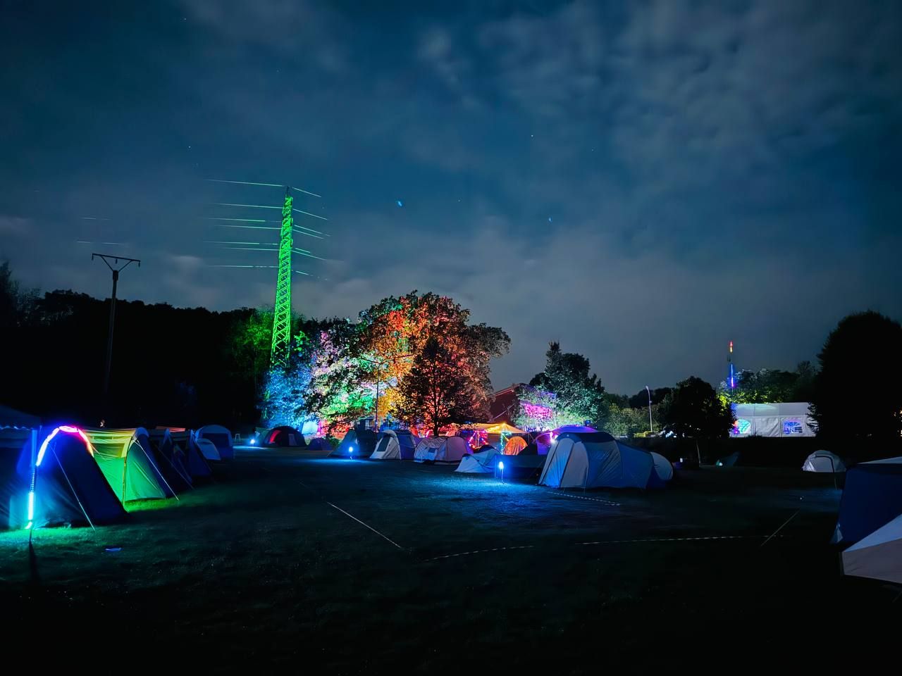
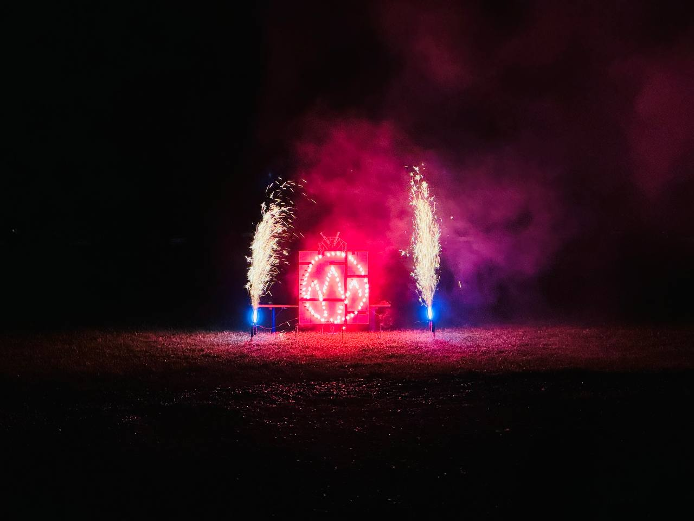

Vom 22. bis 25. August fanden in diesem Jahr über 100 Gäste den Weg zur Jugend- und Freizeitanlage in Rothenhain. Zum dritten Mal fand dieses Jahr das [Westwoodcamp aka WAMP](https://westwood.camp/) statt. Bei bestem Wetter bastelten, hackten, networkten und entspannten sich die Teilnehmerinnen und Teilnehmer in einer lockeren Umgebung.

Der beheizte Pool knackte dieses Jahr nicht nur den Rekord der Anzahl der Personen, sondern auch die 30°C Marke. Wem das zu kalt war, konnte sich davor oder danach in der mobilen Fasssauna aufwärmen. Wer Ruhe suchte, dem Stand unsere Lounge mit mehreren Hängematten, Sitzmöbel und Luftbetten zur Verfügung oder konnte sich in der UV-Cave mit fluoreszierendem Klebeband kreativ austoben.

Auch dieses Jahr gab es wieder zahlreiche Vorträge und Workshops, wie die folgenden Stichwörter (Auswahl) zeigen: Wearable LEDs, Sicherheit von Balkonsolaranlagen, DIY Rosinenbrot, Micropython, Feuerwerk, Bienen im digitalen Zeitalter, Bäume und Sträucher bestimmen rund ums WAMP und CTF for absolute beginners...

Die [Vorträge und Workshops](https://wiki.westwood.camp/bin/view/WAMP2024/Vortr%C3%A4ge/) fanden in diesem Jahr nicht nur in einem eigenen Vortragszelt statt, sondern es ging beim Kletterworkshop an mehreren Tagen auch hoch hinaus. Unsere Freunde vom [ZTL](https://ztl.space/) boten in einem weiteren Zelt während der ganzen Veranstaltung verschiedene Lötkits und Lötworkshops an.

Für das leibliche Wohl der Teilnehmer vor Ort wurde natürlich wieder bestens gesorgt. Im Ticketpreis war unser “ewiges Frühstück” mit einer großen Auswahl aus Käse, Aufschnitt, Aufstrichen und Obst enthalten. Zusätzlich gab es jeden Abend eine frische, warme Mahlzeit und Nachtisch. Zwischendurch konnten sich die Teilnehmerinnen und Teilnehmer mit gekühlten Getränken, verschiedenen Eisspezialitäten und natürlich Waffeln vom WOC versorgen.

Für eine stimmungsvolle Atmosphäre sorgte erneut eine farbenfrohe Beleuchtung auf dem weitläufigen Gelände, welches in die wunderschöne Landschaft des Westerwaldes eingebettet ist.

Wer eben gut aufgepasst hat, konnte etwas von Feuerwerk lesen: Das Vortragsprogramm endete am letzten Abend des WAMPs mit einem Feuerwerker-Workshop, bei dem die Teilnehmenden unter fachkundiger Anleitung und Aufsicht ein mehrstufiges Feuerwerk zusammenstellten. Dieses wurde dann mit musikalischer Begleitung abgebrannt und lockte auch den letzten Teilnehmer vom Bildschirm raus auf die Bühne und ein Lächeln ins Gesicht <3.

Wir möchten an dieser Stelle nochmal allen Wesen danken, die uns in diesem Jahr mit Vorträgen, Workshops, Material oder Arbeitskraft unterstützt und damit die Veranstaltung erst ermöglicht haben. Schön, dass ihr da gewesen seit, klasse wie wir gemeinsam das Event gestaltet haben.

Wir freuen uns nun schon auf das WAMP2025 und hoffen, ihr seid dann auch wieder mit dabei!
